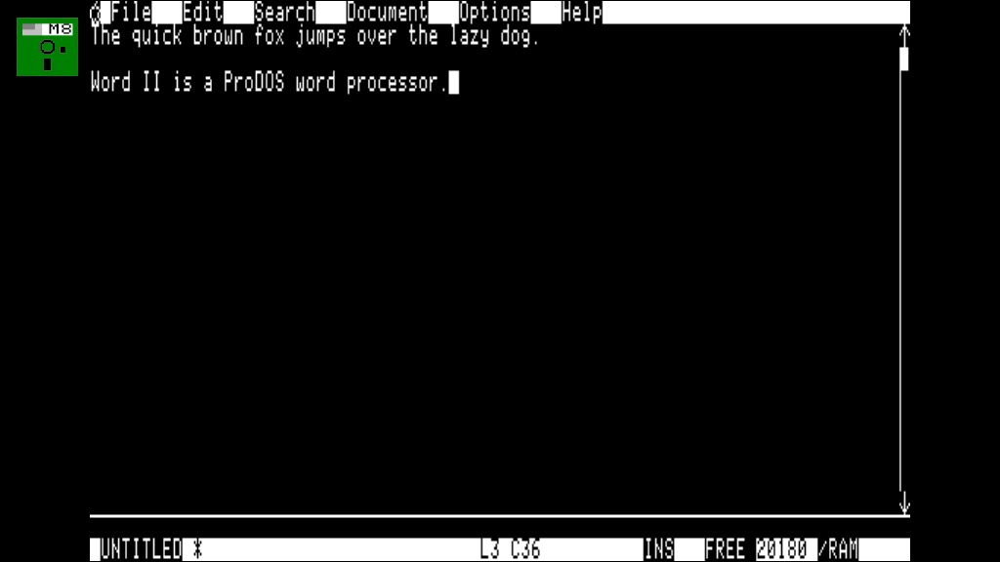

# Word II

A full-featured **ProDOS 8 word processor** for the Enhanced Apple IIe family,
written in 65C02 assembly (Merlin32). It boots into an 80-column MouseText
desktop UI with pull-down menus, modal dialogs, a scrolling ProDOS file picker,
flicker-free word-wrapped editing, search/replace, a clipboard, and undo.

Target machines: **Enhanced Apple IIe, IIc, IIc+, and IIgs in 8-bit mode**,
≥128K RAM, ProDOS 8. 65C02 instructions only; no 65816 native mode, no
undocumented opcodes.



## Running it

Word II is a ProDOS **SYS** program (`WORDII.SYSTEM`, loads at `$2000`).

**In the [microM8](https://paleotronic.com/software/microm8/) emulator** (the
verified path) — boot the built disk image:

```
microM8 -no-update -drive1 build/WORDII.po
```

The disk boots ProDOS to the BASIC `]` prompt; launch Word II with:

```
-WORDII.SYSTEM
```

On real hardware, copy `WORDII.SYSTEM` to any bootable ProDOS volume and run it
the same way (`-WORDII.SYSTEM` from BASIC.SYSTEM, or make it the startup
`.SYSTEM` file).

## Controls

The screen has a **menu bar** (row 0), the **text area** (rows 1–21) with a live
**scroll bar** on the right, and a **status line** (bottom row) showing filename,
modified flag (`*`), line:column, INS/OVR mode, free memory, and `/RAM` status.

### Editing keys

| Key | Action |
|-----|--------|
| Arrow keys | Move the cursor (wraps across paragraphs) |
| Return | Split paragraph / new line |
| Delete | Backspace (joins the previous line at column 0) |
| Ctrl-D | Forward delete (joins the next line at end of line) |
| Ctrl-A / Ctrl-E | Start / end of the current line |
| Tab | Insert spaces to the next tab stop |
| Ctrl-O | Toggle Insert / Overwrite |
| printable keys | Insert text (word-wrapped on screen automatically) |

### Menus

Press **Esc** to open the menu bar. **Left/Right** switch menus, **Up/Down**
move the highlight, **Return** selects, **Esc** cancels. Type a letter to jump
to a matching item (type-ahead). The menus:

- **File** — New, Open…, Save, Save As…, Close, Rename…, Delete…, Quit
- **Edit** — Undo, Cut, Copy, Paste, Select All
- **Search** — Find, Find Next, Replace
- **Document** — Reflow, Go To Line, Word Count
- **Options** — Ins/Ovr, Margins, Tab Width
- **Help** — About, Keys

### Open-Apple shortcuts

Hold **Open-Apple** (⌘, the solid-apple key) and press the letter:

`⌘N` New · `⌘O` Open · `⌘S` Save · `⌘W` Close · `⌘Q` Quit ·
`⌘Z` Undo · `⌘X` Cut · `⌘C` Copy · `⌘V` Paste · `⌘A` Select All ·
`⌘F` Find · `⌘G` Find Next · `⌘R` Replace · `⌘J` Go To Line · `⌘?` Keys.

Everything is reachable by keyboard; Open-Apple shortcuts are a convenience.

### Dialogs and the file picker

File operations are dialog-based. **Open** shows a scrolling list of the files
in the current directory — Up/Down to move, type a letter to jump, Return to
open, Esc to cancel. **Save As / Rename / Delete** prompt for a name (type a
bare name to use the current volume, or a full `/VOLUME/PATH` to go elsewhere).
Errors are reported with readable ProDOS names ("File not found", "Disk is full",
"File is locked", …), and destructive actions confirm first.

## File format

Documents are plain **ProDOS TXT** files (type `$04`): standard 7-bit ASCII with
a single carriage return (`$0D`) separating paragraphs. This interchanges with
any text tool. Internally the editor keeps text in high-bit (Apple normal-video)
form and translates at the I/O boundary; on load it also accepts classic
high-bit Apple II text and `$8D` line breaks. Paragraphs are *logical* lines —
word wrap is a display feature, so the stored file has no hard wrap inside a
paragraph.

## Architecture

The document is stored as a **line table** (one record per paragraph) plus a
**text heap** of the paragraph bytes, with the cursor's paragraph held in a
**gap buffer** for O(1) editing — not one fragile contiguous buffer. Rendering
composites each row in RAM and blits it (no flicker), and skips unchanged rows
during typing. Full design and the zero-page / main / aux / `/RAM` memory map:

- [docs/ARCHITECTURE.md](docs/ARCHITECTURE.md)
- [docs/MEMORY-MAP.md](docs/MEMORY-MAP.md)
- [docs/ROADMAP.md](docs/ROADMAP.md)

## Building

```
scripts/build.sh     # assemble with Merlin32 -> build/WORDII.SYSTEM (+ symbols)
scripts/mkdisk.sh    # stage WORDII.SYSTEM onto a bootable ProDOS disk -> build/WORDII.po
```

Requires [`merlin32`](https://github.com/apple2infinitum/Merlin32) and
[`cp2`](https://github.com/fadden/CiderPress2) (CiderPress II) on `PATH`.
`build.sh` reads Merlin32's library from `$MERLIN32_LIB` (default
`$HOME/merlin32/Library`); `mkdisk.sh` needs `$PRODOS_TEMPLATE` pointing at a
bootable ProDOS disk image to clone (most Apple II emulators ship one).

## Testing

Two tiers. The py65 simulator harness is vendored in `tests/vendor/`, so the
unit tier needs only the [`py65`](https://pypi.org/project/py65/) package:

```
# Unit tests: drive the real binary's routines by symbol in the py65 simulator
pip install py65
python3 tests/run_tests.py

# Acceptance tests: boot the disk in microM8 and drive it like a real machine
# (needs microM8 + the `mcp` package; set MICROM8_DIR to your microM8 install)
pip install mcp
MICROM8_DIR=/path/to/microM8 bash tests/acceptance/m1_boot.sh
MICROM8_DIR=/path/to/microM8 bash tests/acceptance/m2_edit.sh
MICROM8_DIR=/path/to/microM8 bash tests/acceptance/m3_files.sh
```

The unit suite covers the document store, cursor/edit logic, word wrap, search/
replace, clipboard, undo, the MLI wrappers (against a faked MLI), and the
directory parser. The acceptance scripts boot the generated disk image and
confirm boot, the 80-column UI, editing, save/reopen, and the file picker on
real ProDOS.

> **Note on microM8 compatibility.** The acceptance tier drives microM8
> through its scriptable MCP/CLI control plane (loading memory, typing keys,
> reading the text screen back). It was developed and verified against a
> specific microM8 build whose control-plane interface had been extended for
> this work; the command and tool surface there may differ from a stock
> [microM8](https://paleotronic.com/software/microm8/) release. If you point
> `MICROM8_DIR` at a different build, expect the acceptance scripts to need
> adjustment — the harness assumes that build's MCP/CLI behavior, so it is not
> guaranteed to run unchanged elsewhere. The **unit tier above has no such
> dependency** and is the portable way to verify the binary; everyday emulation
> (the `microM8 -drive1 …` launch under [Running it](#running-it)) uses only
> standard flags and is unaffected.

## Known limitations

- **Document capacity** is the ~20 KB main-memory text heap (M0–M4). The heap
  compacts to reclaim space abandoned by edits, so the status-line **FREE**
  figure reflects live document size and deleting text returns memory. The line
  table / heap are further designed so the heap can move to auxiliary memory and
  spill to a `/RAM` scratch file for much larger documents; that paging layer is
  designed (see ARCHITECTURE) but not yet wired, so very large files are
  refused with "Document too large" rather than paged.
- **Mouse** is not yet wired; the editor is fully keyboard-driven (the spec's
  required keyboard fallback). Mouse support is the next milestone.
- **Undo** is single-level and covers in-paragraph edits; it is invalidated by
  navigation and structural operations (split/join, cut/paste).
- Paragraphs are capped at 1024 bytes; longer single paragraphs are not split
  on load.
- On a 1 MHz machine, redraw of heavily-wrapped text is visible but usable; it
  is faster on a IIgs / accelerated IIc+.

## Status

Milestones M0–M4, plus an M7 cleanup/polish pass, are complete and verified
(**80 unit tests** + acceptance scripts): boot, 80-column MouseText UI, editing
with word wrap, the full ProDOS file UI, search/replace/clipboard/undo/reflow/
tabs, Go To Line and Word Count. The UI was tuned to match classic Apple II
desktop apps — Glen-Bredon-style titled dialog frames, MouseWrite-style pull-down
menus, embossed buttons, and a proportional-scrollbar file picker — and the text
heap now compacts so deletes return memory. See
[docs/SUMMARY.md](docs/SUMMARY.md) for what works, what was verified, and what
remains.
